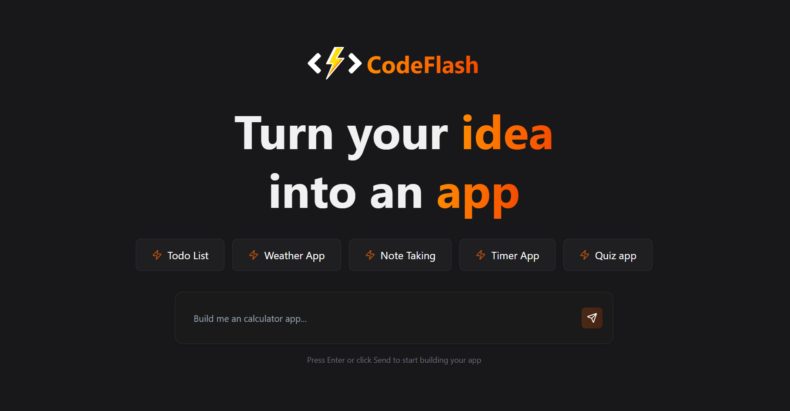
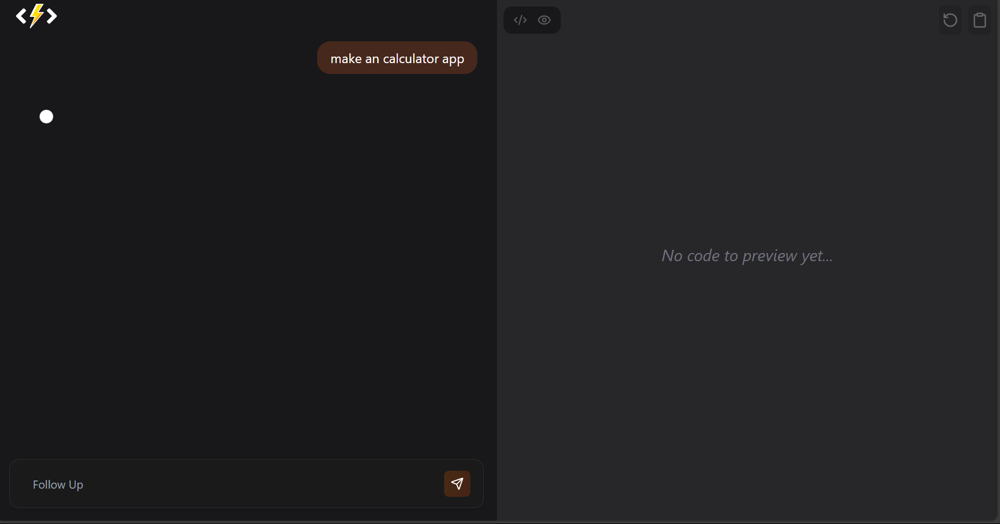
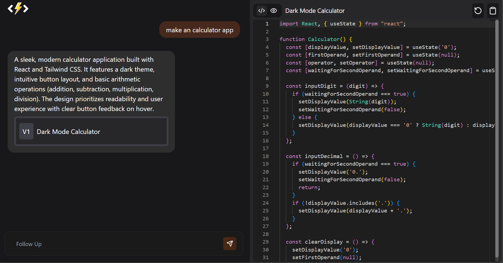
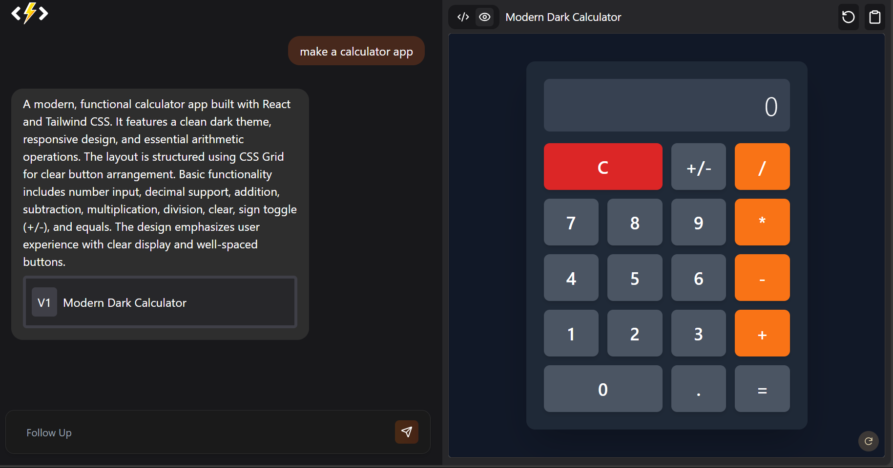
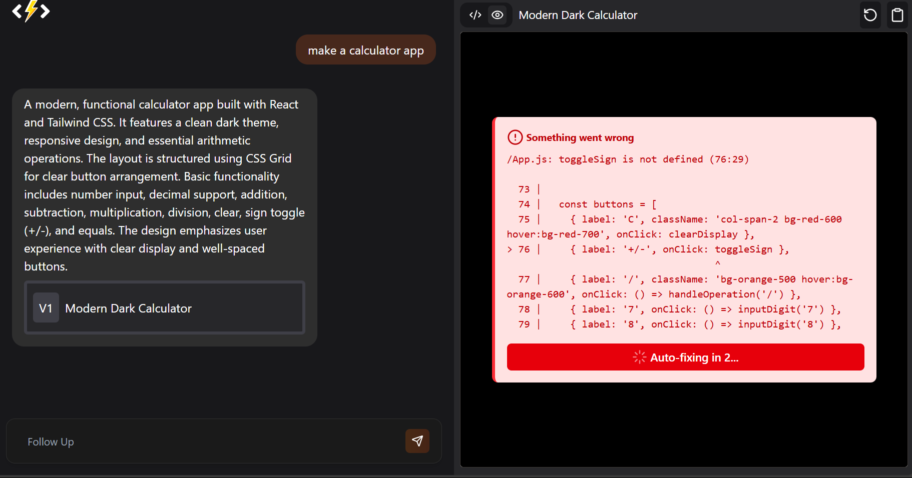
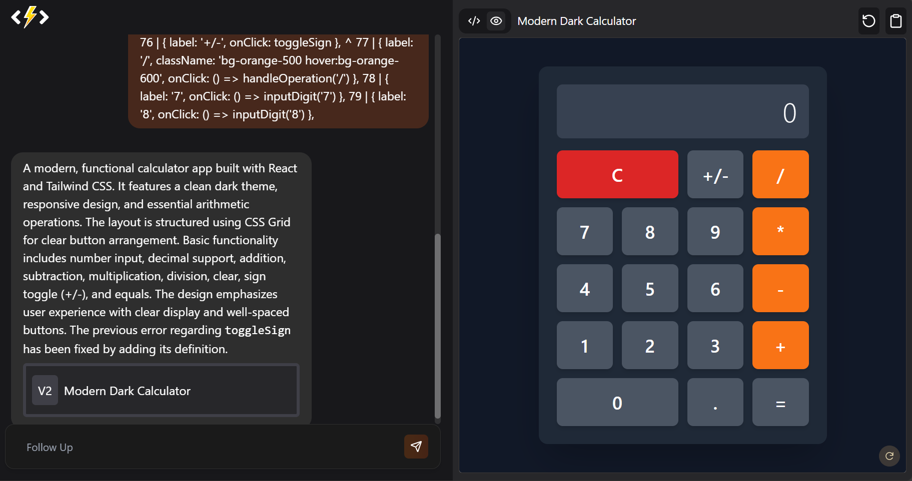

## 🚀 CodeFlash – Your AI App-Building Assistant

CodeFlash is a modern, full-stack web application that uses **Gemini AI** to help you build beautiful, production-ready **React + TailwindCSS** UIs from natural language prompts.

### 🧠 Features

- ✨ Ask for **UI components, apps, or full features** in natural language
- ⚛️ Generates clean **React code** with **TailwindCSS**
- 📦 Automatically includes required dependencies
- ⚙️ Built with **Gemini 2.5 Flash API** via Google GenAI SDK
- 🛠️ Built-in Code Editor to modify generated code
- 📺 Live Preview updates in real-time as user types

---

## ⚙️ Tech Stack

| Frontend            | Backend           | AI Model         |
| ------------------- | ----------------- | ---------------- |
| React + TailwindCSS | Node.js + Express | Gemini 2.5 Flash |

---

## 🔐 Environment Variables (`.env`)

Make sure to add your GenAI API Key:

```bash
GOOGLE_API_KEY=your_google_api_key_here
```

---

## 🛠️ Installation

### 1. Clone the repo

```bash
git clone https://github.com/rohitkhot1718/codeflash.git
cd codeflash
```

### 2. Install dependencies

```bash
# For backend
cd server
pnpm install

# For frontend
cd client
pnpm install
```

---

## 🧪 Running Locally

### Start the Backend

```bash
cd server
pnpm start
```

### Start the Frontend

```bash
cd client
pnpm run dev
```

Visit: `http://localhost:5173`

---

## 📸 Screenshots

<div align="center">






</div>
---

## ✍️ Prompt Examples

```txt
- Build a dark-themed login page with React and TailwindCSS
- Create a modern navbar with icons and animation
- Generate a todo app UI with Add, Delete, and Mark Done
- Make a profile card component using lucide-react icons
```

---

## 📜 License

MIT – feel free to fork, remix, and build something awesome!

---
